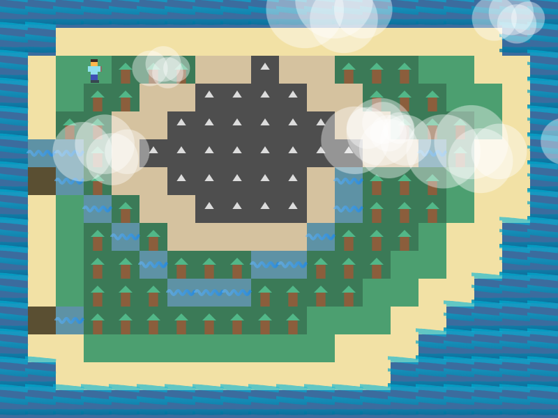
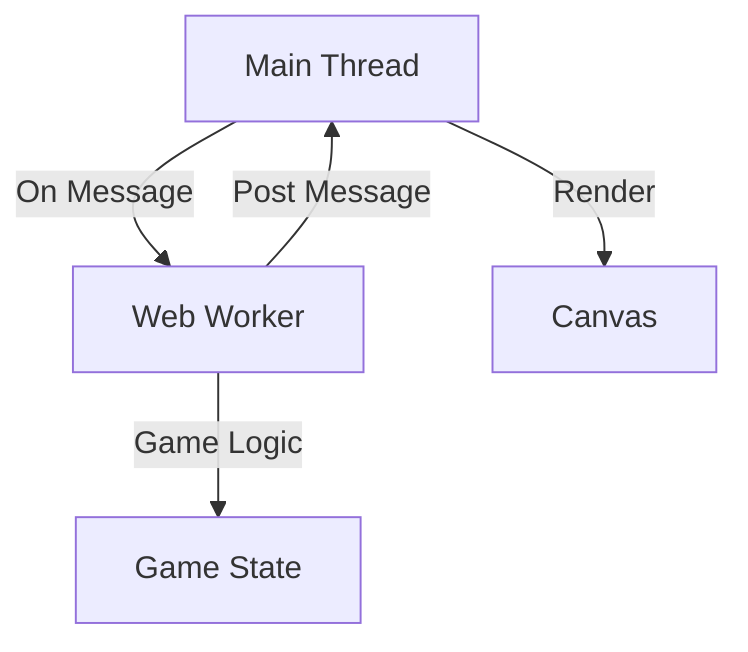

# Simple Pixel Game with Web Workers

A pixel-style terrain exploration game built with SvelteKit, TypeScript, and Web Workers. This project demonstrates modern web game development techniques with a focus on performance and maintainability.



## Features

- 🎮 Real-time terrain exploration
- 👷 Web Worker-based game logic
- 📊 Performance monitoring
- 🎨 Dynamic animations (clouds, water, rivers)
- 🎯 Responsive controls
- 📱 Mobile-friendly design
- 🌈 Theme support
- 🛠 Debug tools

## Technical Stack

- **Framework**: SvelteKit
- **Language**: TypeScript
- **Styling**: Tailwind CSS
- **Architecture**: Web Workers for game logic
- **Performance**: RAF-based animation system
- **State Management**: Custom game state handler

## Game Elements

### Terrain Types
- 🌊 Water (W) - Impassable boundary
- 🏖 Beach (B) - Transitional zone
- 🌲 Forest (F) - Standard terrain with cover
- ⛰ Mountains (M) - Impassable peaks
- 🌱 Grassland (G) - Open terrain
- 🌊 River (R) - Crossable water
- 🥾 Swamp (S) - Difficult terrain
- 🏔 Hills (H) - Elevated terrain

### Animations
- Cloud system with dynamic generation and movement
- Water wave effects
- River flow animations
- Character movement with direction-based sprites

### Performance Features
- FPS monitoring
- Memory usage tracking
- Idle state management
- Frame throttling
- Efficient canvas rendering

### Debug Features
- Real-time performance metrics
- Game state monitoring
- Terrain information
- Worker status tracking
- Animation controls

## Code Structure

```
src/
├── lib/
│   ├── components/
│   │   └── DebugPanel.svelte   # Performance monitoring component
│   │   └── Controls.svelte     # Game controls component
│   ├── game/
│   │   ├── Game.ts            # Main game logic
│   │   ├── draw.ts            # Canvas rendering functions
│   │   └── state.ts           # Game state management
│   ├── workers/
│   │   └── worker.ts          # Web Worker game logic
│   ├── types.ts               # TypeScript definitions
│   └── theme.ts               # Theming system
└── routes/
    └── +page.svelte           # Main game component
```

## How Web Workers Work

Web Workers allow you to run JavaScript in background threads. They can perform tasks without interfering with the user interface. This is especially useful for tasks that are computationally expensive or need to run asynchronously.

### Web Worker Architecture



### How It Works

1. **Main Thread**: Handles rendering and user input.
2. **Web Worker**: Processes game logic and state management.
3. **Communication**: Main thread and worker communicate via `postMessage` and `onmessage`.
4. **Rendering**: Main thread updates the canvas based on the game state.

### Example Code

#### Main Thread

```typescript
const worker = new Worker('worker.js');

worker.onmessage = (e) => {
    const { gameState } = e.data;
    // Update the game state and render
};

worker.postMessage({ task: 'START' });
```

#### Web Worker

```typescript
self.onmessage = (e) => {
    const { task } = e.data;
    if (task === 'START') {
        // Initialize game state
        postMessage({ gameState });
    }
};
```

### Documentation

- [MDN Web Docs: Using Web Workers](https://developer.mozilla.org/en-US/docs/Web/API/Web_Workers_API/Using_web_workers)
- [MDN Web Docs: Web Workers API](https://developer.mozilla.org/en-US/docs/Web/API/Web_Workers_API)
- [MDN Web Docs: Worker](https://developer.mozilla.org/en-US/docs/Web/API/Worker)

## Game Features

1. **Terrain System**
   - Different terrain types with unique properties
   - Collision detection
   - Movement cost calculations

2. **Animation System**
   - Cloud generation and movement
   - Water wave effects
   - River flow animations
   - Character animations

3. **Performance Optimization**
   - Web Worker offloading
   - Frame rate management
   - Idle state handling
   - Memory monitoring

4. **Debug Tools**
   - FPS counter
   - Memory usage
   - Game state viewer
   - Animation controls

## Controls

- Arrow keys or WASD for movement
- Toggle panels:
  - Debug information
  - Terrain legend
  - Animation settings

## Development

1. Install dependencies:
```bash
bun install
```

2. Start development server:
```bash
bun run dev
```

3. Build for production:
```bash
bun run build
```

## Architecture

The game uses a multi-threaded architecture:

- Main Thread: Handles rendering and user input
- Web Worker: Processes game logic and state management
- RAF Loop: Manages animations and frame timing
- Event System: Coordinates state updates

## Performance Considerations

- Web Worker offloads computation
- Frame throttling based on idle state
- Efficient canvas rendering
- Memory usage optimization
- Animation frame management

## License

MIT License - Feel free to use and modify

## Credits

Created as a demonstration of modern web game development techniques using SvelteKit and TypeScript.
